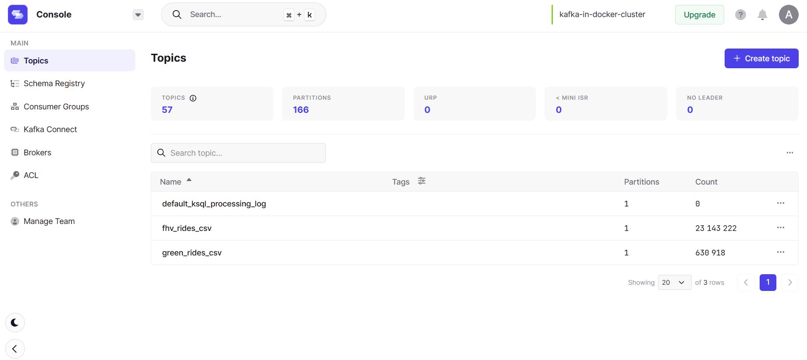

# Week 6 Homework

In this homework, there will be two sections, the first session focus on theoretical questions related to Kafka
and streaming concepts and the second session asks to create a small streaming application using preferred
programming language (Python or Java).

## Question 1

### Please select the statements that are correct

- [X] Kafka Node is responsible to store topics
- [ ] Zookeeper is removed from Kafka cluster starting from version 4.0
- [X] Retention configuration ensures the messages not get lost over specific period of time.
- [X] Group-Id ensures the messages are distributed to associated consumers

> Zookeeper is still an essential component in Kafka architecture, and it is used for coordination, configuration management, and maintaining the overall health of the cluster.

## Question 2

### Please select the Kafka concepts that support reliability and availability

- [X] Topic Replication: This feature ensures that multiple copies of the data are stored across different brokers, which improves the durability and fault-tolerance of the system.
- [X] Topic Paritioning: Partitioning allows for data parallelism and can improve throughput, availability, and scalability of the system by distribution load across different brokers.
- [ ] Consumer Group Id: This is used to group together a set of consumers that work together to consume messages from one or more partitions of a topic. While it is important for managing consumer offsets and load balancing, it does not directly impact reliability and availability.
- [ ] Ack All: This is not a valid Kafka concept. However, acknowledgement (ack) is an important feature of Kafka that ensures reliable delivery of messages by allowing producers to receive confirmation of successful write operations.

## Question 3

### Please select the Kafka concepts that support scaling

- [X] Topic Replication: This feature ensures that multiple copies of the data are stored across different brokers, which improves the durability and fault-tolerance of the system. It also helps to distribute the load across different brokers, which allows for better scaling of the system.
- [X] Topic Paritioning: Partitioning allows for data parallelism and can improve throughput, availability, and scalability of the system by distributing the load across different brokers. It enables you to scale up the number of brokers and consumers to handle more traffic.
- [ ] Consumer Group Id
- [ ] Ack All

## Question 4

### Please select the attributes that are good candidates for partitioning key. Consider cardinality of the field you have selected and scaling aspects of your application

- [ ] payment_type: This field represents the payment method used for the taxi ride, and it may not have a high degree of cardinality. Partitioning the data based on payment_type may result in uneven distribution of data across partitions.
- [X] vendor_id: This field represents the unique identifier of the vendor providing the taxi service, and it could have a high degree of cardinality. Partitioning the data based on vendor_id could allow for efficient processing of queries related to a particular vendor.
- [ ] passenger_count: This field represents the number of passengers in the taxi, and it may not have a high degree of cardinality. Partitioning the data based on passenger_count may also result in uneven distribution of data across partitions.
- [X] total_amount: This field represents the total fare amount paid for the taxi ride, and it could also have a high degree of cardinality. Partitioning the data based on total_amount could allow for efficient processing of queries related to fare ranges.
- [X] tpep_pickup_datetime:This field represents the date and time of the pickup, and it has a high degree of cardinality. Partitioning the data based on pickup date and time could allows for efficient processing of time-based queries.
- [X] tpep_dropoff_datetime: This field represents the date and time of the dropoff, and it also has a high degree of cardinality. Partitioning the data based on dropoff date and time could allow for efficient processing of time-based queries.

> A good partitioning key should have a high degree of cardinality to ensure even distribution of data across partitions, and it should be selected based on how the data will be queried or processed.

## Question 5

### Which configurations below should be provided for Kafka Consumer but not needed for Kafka Producer

- [X] Deserializer Configuration: Consumers need to specify a deserializer to read the message data from Kafka.
- [X] Topics Subscription: Consumers need to specify which topics they want to consume messages from.
- [ ] Bootstrap Server: Both Kafka Consumer and Producer need to specify the bootstrap server to connect to the Kafka cluster.
- [X] Group-Id: Consumers need to specify a unique group id to identify the group of consumers that they belong to.
- [X] Offset: Consumers need to specify the offset from which they want to start consuming messages.
- [ ] Cluster Key and Cluster-Secret: These configurations are not required for either Consumer or Producer.

## Question 6

Please implement a streaming application, for finding out popularity of PUlocationID across green and fhv trip datasets.
Please use the datasets [fhv_tripdata_2019-01.csv.gz](https://github.com/DataTalksClub/nyc-tlc-data/releases/tag/fhv)
and [green_tripdata_2019-01.csv.gz](https://github.com/DataTalksClub/nyc-tlc-data/releases/tag/green)

PS: If you encounter memory related issue, you can use the smaller portion of these two datasets as well,
it is not necessary to find exact number in the  question.

Your code should include following

1. Producer that reads csv files and publish rides in corresponding kafka topics (such as rides_green, rides_fhv)

   ```python
   import abc
   import csv
   from time import sleep
   from typing import Dict

   from kafka import KafkaProducer
   from settings import (
      CONFIG,
      FHV_DATA_PATH,
      GREEN_DATA_PATH,
      PRODUCE_FHV_TOPIC_RIDES_CSV,
      PRODUCE_GREEN_TOPIC_RIDES_CSV,
   )


   def delivery_report(err, msg):
      if err is not None:
         print(f"Delivery failed for record {msg.key()}: {err}")
         return
      message = f"Record {msg.key()} successfully produced to "
      message += f"{msg.topic()} [{msg.partition()}] at offset "
      message += f"{msg.offset()}"
      print(message)


   class CSVProducer(metaclass=abc.ABCMeta):
      def __init__(self, props: Dict):
         self.producer = KafkaProducer(**props)

      @abc.abstractstaticmethod
      def read_records(self):
         pass

      def publish(self, topic: str, records: [str, str]):
         for key_value in records:
               key, value = key_value
               try:
                  self.producer.send(topic=topic, key=key, value=value)
                  print(f"Producing record for <key: {key}, value:{value}>")
               except KeyboardInterrupt:
                  break
               except Exception as e:
                  print(f"Exception while producing record - {value}: {e}")

         self.producer.flush()
         sleep(1)


   class FHVCSVProducer(CSVProducer):
      @staticmethod
      def read_records(resource_path: str):
         records, ride_keys = [], []
         # i = 0
         with open(resource_path, "r") as f:
               reader = csv.reader(f)
               _ = next(reader)  # skip the header
               for row in reader:
                  # dispatching_base_num, pickup_datetime, dropOff_datetime, PUlocationID, DOlocationID
                  # SR_Flag, Affiliated_base_number
                  records.append(
                     f"{row[0]}, {row[1]}, {row[2]}, {row[3]}, {row[4]}, {row[5]}, {row[6]}"
                  )
                  ride_keys.append(str(row[0]))
                  # i += 1
                  # if i == 5:
                  #     break
         return zip(ride_keys, records)


   class GreenCSVProducer(CSVProducer):
      @staticmethod
      def read_records(resource_path: str):
         records, ride_keys = [], []
         # i = 0
         with open(resource_path, "r") as f:
               reader = csv.reader(f)
               _ = next(reader)  # skip the header
               for row in reader:
                  # VendorID, lpep_pickup_datetime, lpep_dropoff_datetime, store_and_fwd_flag
                  # RatecodeID, PULocationID, DOLocationID, passenger_count, trip_distance
                  # fare_amount, extra, mta_tax, tip_amount, tolls_amount, ehail_fee
                  # improvement_surcharge, total_amount, payment_type, trip_type, congestion_surcharge
                  records.append(
                     f"{row[0]}, {row[1]}, {row[2]}, {row[3]}, {row[4]}, {row[5]}, {row[6]}, \
                     {row[7]}, {row[8]}, {row[9]}, {row[10]}, {row[11]}, {row[12]}, {row[13]}, \
                     {row[14]}, {row[15]}, {row[16]}, {row[17]}, {row[18]}, {row[19]}"
                  )
                  ride_keys.append(str(row[0]))
                  # i += 1
                  # if i == 5:
                  #     break
         return zip(ride_keys, records)


   if __name__ == "__main__":
      fhv_producer = FHVCSVProducer(props=CONFIG)
      green_producer = GreenCSVProducer(props=CONFIG)
      fhv_ride_records = fhv_producer.read_records(resource_path=FHV_DATA_PATH)
      green_ride_records = green_producer.read_records(resource_path=GREEN_DATA_PATH)
      print(fhv_ride_records)
      print(green_ride_records)
      fhv_producer.publish(topic=PRODUCE_FHV_TOPIC_RIDES_CSV, records=fhv_ride_records)
      green_producer.publish(
         topic=PRODUCE_GREEN_TOPIC_RIDES_CSV, records=green_ride_records
      )
   ```

2. Pyspark-streaming-application that reads two kafka topics
   and writes both of them in topic rides_all and apply aggregations to find most popular pickup location.

   ```python
   from pyspark.sql import SparkSession
   from pyspark.sql.functions import count, desc, from_json
   from pyspark.sql.types import FloatType, StructField, StructType
   from settings import (
      FHV_SCHEMA,
      GREEN_SCHEMA,
      KAFKA_BROKERS,
      PRODUCE_FHV_TOPIC_RIDES_CSV,
      PRODUCE_GREEN_TOPIC_RIDES_CSV,
      RIDES_ALL_TOPIC,
   )

   # Define the schema for the pickup location ID
   pickup_location_schema = StructType([StructField("pickup_location_id", FloatType())])

   # Create a SparkSession
   spark = SparkSession.builder.appName("popular_pickup_locations").getOrCreate()

   # Read from the Green and FHV Kafka topics and write them to the "RIDES_ALL_TOPIC" topic
   df_green = (
      spark.readStream.format("kafka")
      .option("kafka.bootstrap.servers", KAFKA_BROKERS)
      .option("subscribe", PRODUCE_GREEN_TOPIC_RIDES_CSV)
      .option("startingOffsets", "earliest")
      .load()
   )

   df_green.select(
      from_json(df_green.value.cast("string"), GREEN_SCHEMA).alias("data")
   ).select("data.PULocationID").withColumnRenamed("PULocationID", "pickup_location_id")

   df_fhv = (
      spark.readStream.format("kafka")
      .option("kafka.bootstrap.servers", KAFKA_BROKERS)
      .option("subscribe", PRODUCE_FHV_TOPIC_RIDES_CSV)
      .option("startingOffsets", "earliest")
      .load()
   )

   df_fhv.select(from_json(df_fhv.value.cast("string"), FHV_SCHEMA).alias("data")).select(
      "data.PUlocationID"
   ).withColumnRenamed("PUlocationID", "pickup_location_id")

   df_all_rides = df_green.union(df_fhv)

   # Apply aggregations to find the most popular pickup location
   popular_pickup_locations = (
      df_all_rides.groupBy("pickup_location_id")
      .agg(count("*").alias("total_rides"))
      .orderBy(desc("total_rides"))
   )

   # Write the results to the "popular_pickup_locations" Kafka topic
   popular_pickup_locations.selectExpr(
      "CAST(pickup_location_id AS STRING) AS key", "to_json(struct(*)) AS value"
   ).writeStream.format("kafka").option("kafka.bootstrap.servers", KAFKA_BROKERS).option(
      "topic", RIDES_ALL_TOPIC
   ).option(
      "checkpointLocation", "/tmp/checkpoints"
   ).start().awaitTermination()

   ```



## Submitting the solutions

- Form for submitting: <https://forms.gle/rK7268U92mHJBpmW7>
- You can submit your homework multiple times. In this case, only the last submission will be used.

Deadline: 13 March (Monday), 22:00 CET

## Solution

We will publish the solution here after deadline
