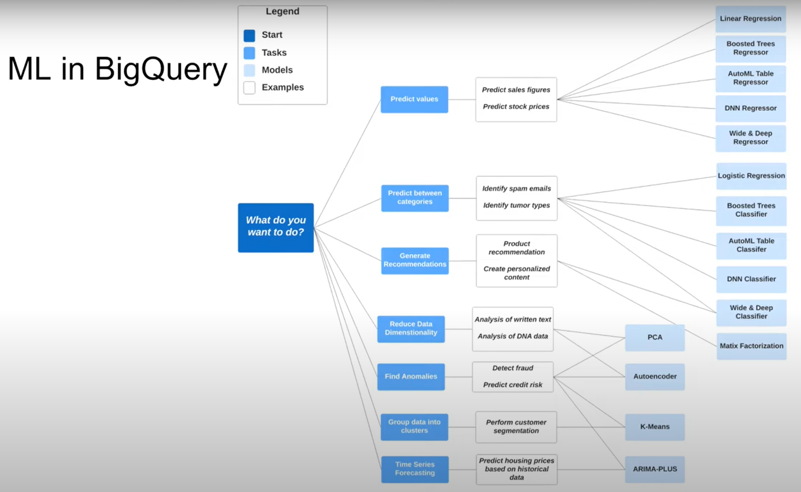

# Data Warehouse and Big Query Notes

## OLAP vs OLTP

* OLAP: Online Analytical Processing
* OLTP: Online Transaction Processing

| | **OLTP** | **OLAP** |
|:--|:--|:--|
| Purpose | Control and run essential business operations in real time | Plan, solve problems, support decisions, discover hidden insights |
| Data updates | Short, fast updates initiated by user | Data periodically refreshed with scheduled, long-running batch jobs |
| Database design | Normalized databases for efficiency | Denormalized databases for analysis |
| Space requirements | Generally small if historical data is archived | Generally large due to aggregating large datasets |
| Backup and recovery | Regular backups rquired to ensure business continuity and meet legal governance requirements | Lost data can be reloadd from OLTP database as needed in lieu of regular backups |
Productivity | Increases productivity of end users | Increases productivity of business managers, data analysts, and executives |
|Data view | Lists day-to-day business transactions | Multi-dimensional view of enterprise data |
| User examples | Customer-facing personnel, clerks, online shoppers | Knowledge workers such as data analysts, busines analysts, and executives |

## What is data warehouse


## BigQuery

* Serverless data warehouse
  * There are no servers to manage or database software to install
* Software as well as infrastructure including
  * **scalability** and **high-availability**
* Built-in featuers like
  * machine learning
  * geospacial analysis
  * bunisness intelligence
* BigQuery maximizes flexibility by seperating the compute engine that analyzes your data from your storage

### BigQuery Cost

* On demand pricing
  * 1TB of data processed is $5
* Flat rate pricing
  * Based on number of pre rquested slots
  * 100 slots -> $2,000/month = 400TB data processed on demand pricing

### Partitions and Clustering

BigQuery Partitioning

* Time-unit column
* Ingestion time (_PARTITIONTIME)
* Integer range partitioning
* When using Time unit or ingestion time
  * Daily (Default)
  * Hourly
  * Monthly or yearly
* Number of partitions limit is 4000

Resourse: <https://cloud.google.com/bigquery/docs/partitioned-tables>


As can be seen here, a table can be partitioned by date to improve BigQuery performance.

#### Example of table partition by date

```sql
CREATE OR REPLACE TABLE taxi-rides-ny.nytaxi.yellow_tripdata_partitoned
PARTITION BY
  DATE(tpep_pickup_datetime) AS
SELECT * FROM taxi-rides-ny.nytaxi.external_yellow_tripdata;
```

#### BigQuery Clustering

* Columns you specify are used to colocate related data
* Order of the column is important
* The order of the specified columns determines the sort order of the data
* Clustering improves
  * Filter queries
  * Aggregate queries
* Table with data size < 1GB, don't show sognificant improvement with partitioning clustering
* You can specify up to four clustering columns

#### Clustering columns must be top-level, non-repeated columns

* DATE
* BOOL
* GEOGRAPHY
* INT64
* NUMERIC
* BIGNUMERIC
* STRING
* TIMESTAMP
* DATETIME


#### Example of partitioning and clustering data

```sql
CREATE OR REPLACE TABLE taxi-rides-ny.nytaxi.yellow_tripdata_partitoned_clustered
PARTITION BY DATE(tpep_pickup_datetime)
CLUSTER BY VendorID AS
SELECT * FROM taxi-rides-ny.nytaxi.external_yellow_tripdata;
```

| **Clustering** | **Partitioning** |
|:---------------|:-----------------|
| Cost benefit unknown | Cost known upfront
| You need more granualarity than partitioning alone allows | You need partition-level management |
| Your queries commonly use filters or aggregation against multiple particular columns | Filter or aggregate on single column |
| The cardinality of the number of values in a column or group of columns is large ||

#### Clustering over partitioning

* Partitioning results in a small amount of data per partition (approximately less than 1GB)
* Partitioning results in a large number of partitions beyond the limits on partitioned tables
* Partitioning results in your mutation operations modifying the majority of partitions in the table frequently (for example, every few minutes)

#### Automatic reclustering

As data is added to a clustered table

* the newly inserted data can be written to blocks that contain key ranges that overlap with the key ranges in previously written blocks
* These overlapping keys weaken the sort property of the table

To maintain the performance characteristics of a clustered table

* BigQuery performs automatic re-clustering in the background to restore the sort property of the table
* For partitioned tables, clustering is maitained for data within the scope of each partition.

### Best practices

#### BigQuery-Best Practice

* Cost reduction
  * Avoid SELECT *
  * Price your queries before running them
  * Use clustered or partitioned tables
  * User streaming inserts with caution
  * Materialize query results in stages

* Query performance
  * Filter on partitioned columns
  * Denormalizing data
  * Use nested or repeated columns
  * Use external data soruces appropriately
  * Don't use it, in case u want a high query performance
  * Reduce data before using a JOIN
  * Do not treat WITH clauses as prepared statements
  * Avoid oversharding tables
  * Avoid JavaScript user-defined functions
  * Use approximate aggregation functions (HyperLogLog++)
  * Order Last, for query oerations to maximize performance
  * Optimize your join patterns
  * As a best practice, place the table with the largest number of rows first, follwoed by the table with the fewest rows, and then place the remaining tables by decreasing size.

### Internals


BigQuery utilizes a column-oriented structure.


### Reference

* <https://cloud.google.com/bigquery/docs/how-to>
* <https://research.google/pubs/pub36632/>
* <https://panoply.io/data-warehouse-guide/bigquery-architecture/>
* <https://www.goldsborough.me/distributed-systems/2019/05/18/21-09-00-a_look_at_dremel/>

### Machine Learning in BigQuery

* Target audience Data analysts, managers
* No need for Python or Java knowledge
* No need to export data into a different system

#### ML in BigQuery Pricing

* Free
  * 10 GB per month of data storage
  * 1 TB per month of queries processed
  * ML Create model step: First 10 GB per month is free




### Feature preprocessing overview

Feature preprocessing is one of the most important steps in developing a machine learning model. It consists of the creation of features as well as the cleaning of the data. Sometimes, the creation of features is also referred as "feature engineering".

### Feature preprocessing offerings

BigQuery ML supports two tupes of features preprocessing:

* **Automatic preprocessing**. BigQuery ML performs automatic preprocessing during training. For more information, see Automatic feature preprocessing.

* **Manual preprocessing**. BigQuery ML provides the `TRANSFORM` clause for you to define custome preprocessing using the manual preprocessing functions. You can also use these functions outside the `TRANSOFORM` clause.

Additionally, you can use the `ML.FEATURE_INFO` function to retrieve the statistics of all input feature columns.
