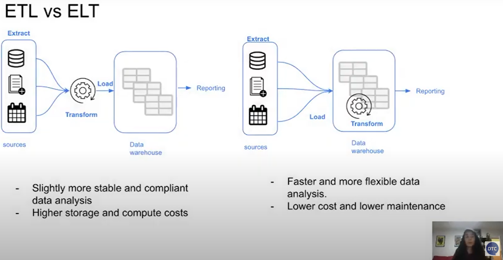
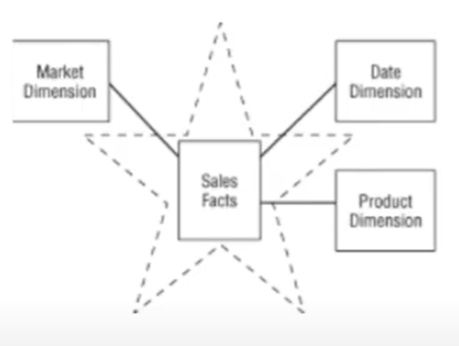
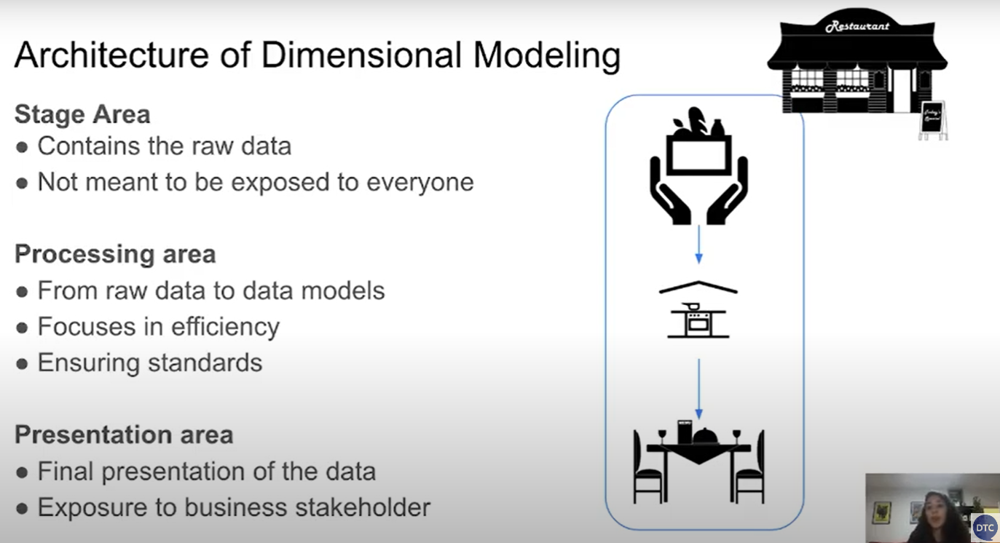
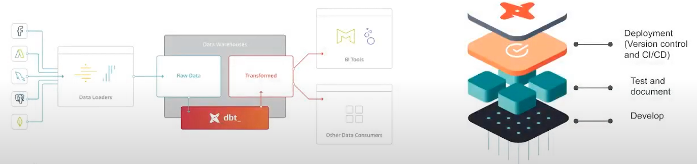
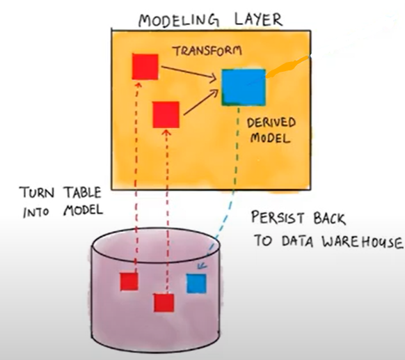
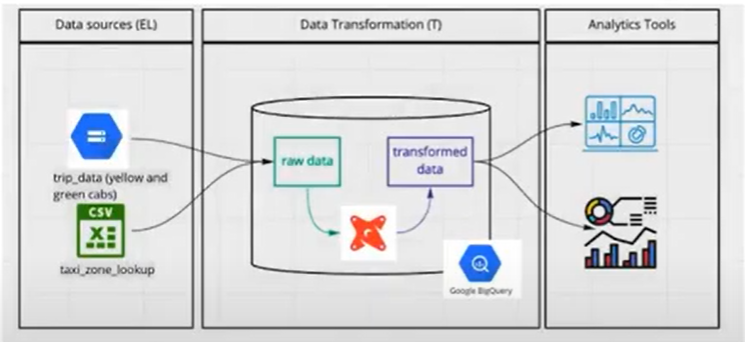
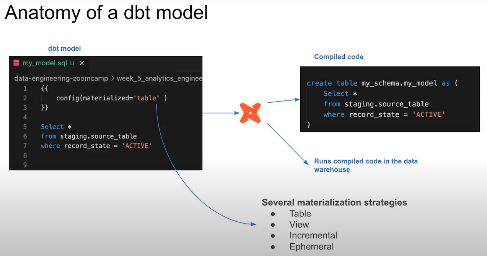

# Analytics Engineering

## Data Domain Developments

* Massively parallel processing (MPP) databases
* Data-pipelines-as-a-service
* SQL-first
* Version control systems
* Self service analytics
* Data Governance

### Roles In Data Team

* Data Engineer: Prepares and maintains the infrastructure the data team needs.
* Analytics Engineer: Introduces the good software engineering practices to the efforts of data analytics and data scientists.
* Data Analyst: Uses data to answer questions and solve problems.

### Tooling

* Data Loading
* Data Storing
  * Cloud data warehouses like Snowflake, BigQuery, Redshift
* Data modeling
  * Tools like dbt or Dataform
* Data presentation
  * BI tools like google data studio, Looker, Mode or Tableau

### Data Model Concepts



### Kimball's Dimensional Modeling

* Objective
  * Deliver data undestandable to the business users
  * Deliver fast query performance
* Approach
  * Prioritize user understandability and query performance over non redundant data (3NF)
* Other approaches
  * Bill Inmon
  * Data vault

### Elements of Dimensional Modeling



* Facts tables
  * Measurements, metrics or facts
  * Corresponds to a business *process*
  * **verbs**
* Dimensions tables
  * Corresponds to a business *entity*
  * Provides context to a business process
  * **nouns**

### Architecture of Dimensional Modeling



## What is dbt?

**dbt**: Data build tool

dbt is a transformation tool that allows anyone that knows SQL to deploy analytics code follwoing software engineering best practices like modularity, portability, CI/CD, and documentation.



### How does dbt work?

Each model is:

* A *.sql file
* Select statement, no DDL or DML
* A file that dbt will compile and run in our DWH



### How to use dbt?

| dbt Core | dbt Cloud |
|:---------|:----------|
| Open-source project that allows the data transformation | Saas application to develop and manage dbt projects |
| * Builds and runs a dbt project (.sql and .yml files) | * Web-based IDE to develop, run and test a dbt project |
| * Includes SQL compilation logic, macros and database adapters | * Jobs orchestration |
| * Includes a CLI interface to run dbt commands locally | * Logging and Alerting |
| * Open source and free to use | * Integrated documentation |
| | * Free for individuals (one developer seat) |

### How are we going to use dbt?

* BigQuery
  * Development using cloud IDE
  * No local installation of dbt core
* Postgres
  * Develoment using a local IDE of your choice
  * Local installation of dbt core connecting to the Postgres database
  * Running dbt models through the CLI



### Starting a dbt project

#### Create a new dbt project

dbt provides a starter project with all the basic folders and files.

There are essentially two ways to use it:

* **With the CLI**
  * After having installed dbt locally and setup the *profiles.yml*, run `dbt init` in the path we want to start the project to clone the starter project.
* **With dbt cloud**
  * After having setup the dbt cloud credentials (repo and dwh) we can start the project from the web-based IDE.

### Development of dbt models



#### The FROM clause of a dbt model

##### Sources

* The data loaded to our dwh that we use as sources for our models
* Configuration defined in the yml files in the models folder
* Used with the source macro that will resolve the name to the right schema, plus build the dependencies automatically
* Source freshness can be defined and tested

```yaml
sources:
    - name: staging
      database: production
      schema: trip_data_all

      loaded_at_field: record_loaded_at
      tables:
        - name: green_tripdata
        - name: yellow_tripdata
          freshness:
            error_after: {count: 6, period: hour}
```

##### Seeds

* CSV files stored in our repository under the seed folder
* Benefits of version controlling
* Equivalent to a copy command
* Recommended for data that doesn't change frequently
* Runs with `dbt see -s file_name`

```sql
select
    locationid,
    borough,
    zone,
    replace(service_zone, 'Boro', 'Green') as service_zone
from {{ ref('taxi_zone_lookup') }}
```

##### Ref

* Macro to reference the underlying tables and views that were building the data warehouse
* Run the same code in any environment, it will resolve the correct schema for you
* Dependencies are built automatically

*dbt model*:

```sql
with green_data as (
  select *,
      'Green' as service_type
  from {{ ref('stg_green_tripdata') }}
),
```

*compiled code*:

```sql
with green_data as (
  select *,
      'Green' as service_type
  from "production", "dbt_victoria_mola", "stg_green_tripdata"
),
```

##### Macros

* Use control structures (e.g. if statements and for loops) in SQL
* Use environment variables in your dbt project for production deployments
* Operate on the results of one query to generate another query
* Abstrct snippets of SQL into reusable macros -- these are analogous to functions in most programming languages

*Definition of the macro*:

```sql
{#
    This macro returns the description of the payment_type
#}



    case {{ payment_type }}
        when 1 then 'Credit card'
        when 2 then 'Cash'
        when 3 then 'No charge'
        when 4 then 'Dispute'
        when 5 then 'Unknown'
        when 6 then 'Voided trip'
    end


```

 *Usage of the macro*:

 ```sql
 select
    {{ get_payment_type_description('payment_type') }} as payment_type_description,
    congestion_surcharge::double precision
 from {{ source('staging', 'green_tripdata_2021_01') }}
 where vendorid is not null
 ```

 *Compiled code of the macro*:

 ```sql
 create or alter view production.dbt_vicorotia_mola.stg_green_tripdata as
 select
     case payment_type
        when 1 then 'Credit card'
        when 2 then 'Cash'
        when 3 then 'No charge'
        when 4 then 'Dispute'
        when 5 then 'Unknown'
        when 6 then 'Voided trip'
    end as payment_type_description,
    congestion_surcharge::double precision
 from "production", "staging", "green_tripdata_2021_01"
 where vendorid is not null
 ```

##### Packages

* Like libraries in other programming languages
* Standalone dbt projects, with models and macros that tackle a specific problem area
* By adding a package to your project, the package's models and macros will become part of your own project
* Imported in the **packages.yml** file and imported by running `dbt deps`
* A list of useful packages can be found in dbt package hub

*Specifications of the packages to import in the project*:

```yaml
packages:
  - package: dbt-labs/dbt_utils
    version: 0.8.0
```

*Usage of a macro from a package*:

```sql
{{ config(materialized='view) }}

select
    -- identifiers
    {{ dbt_utils.surrogate_key(['vendorid', 'lpep_pickup_datetime]) }} as tripid,
    cast(vendorid as integer) as vendorid,
    cast(ratecodeid) as integer) as ratecodeid,
```

```sql
-- create external tables
CREATE OR REPLACE EXTERNAL TABLE `dtc-de-course-374214.trips_data_all.ext_green_tripdata`
OPTIONS (
    format = "PARQUET",
    uris = ["gs://dtc_data_lake_dtc-de-course-374214/dtc_ny_taxi_tripdata/green/*.parquet.snappy"]
);

CREATE OR REPLACE EXTERNAL TABLE `dtc-de-course-374214.trips_data_all.ext_yellow_tripdata`
OPTIONS (
    format = "PARQUET",
    uris = ["gs://dtc_data_lake_dtc-de-course-374214/dtc_ny_taxi_tripdata/yellow/*.parquet.snappy"]
);

CREATE OR REPLACE EXTERNAL TABLE `dtc-de-course-374214.trips_data_all.ext_fhv_tripdata`
OPTIONS (
    format = "PARQUET",
    uris = ["gs://dtc_data_lake_dtc-de-course-374214/dtc_ny_taxi_tripdata/fhv/*.parquet.snappy"]
);

-- create native partitioned tables
CREATE OR REPLACE TABLE `dtc-de-course-374214.trips_data_all.green_tripdata`
PARTITION BY DATE(lpep_pickup_datetime)
AS (
    SELECT *
    FROM `dtc-de-course-374214.trips_data_all.ext_green_tripdata`
);

CREATE OR REPLACE TABLE `dtc-de-course-374214.trips_data_all.yellow_tripdata`
PARTITION BY DATE(tpep_pickup_datetime)
AS (
    SELECT *
    FROM `dtc-de-course-374214.trips_data_all.ext_yellow_tripdata`
);

CREATE OR REPLACE TABLE `dtc-de-course-374214.trips_data_all.fhv_tripdata`
PARTITION BY DATE(pickup_datetime)
AS (
    SELECT *
    FROM `dtc-de-course-374214.trips_data_all.ext_fhv_tripdata`
);
```
